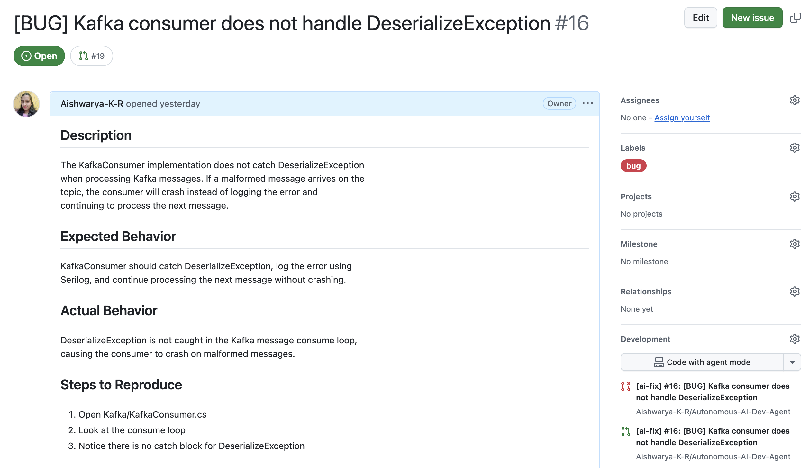
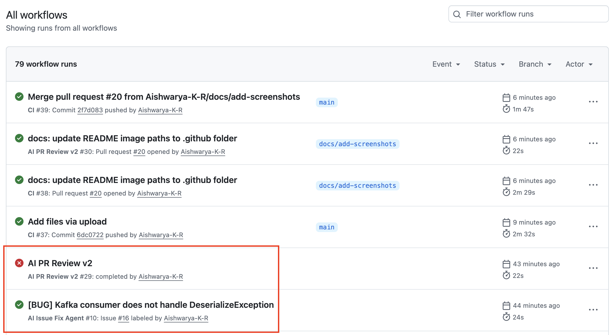
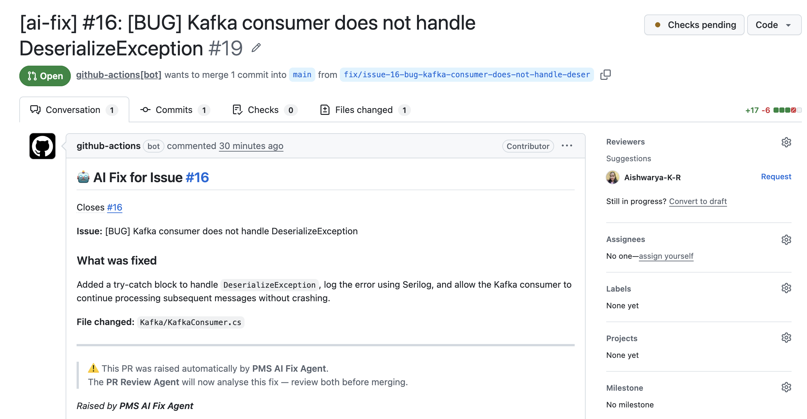
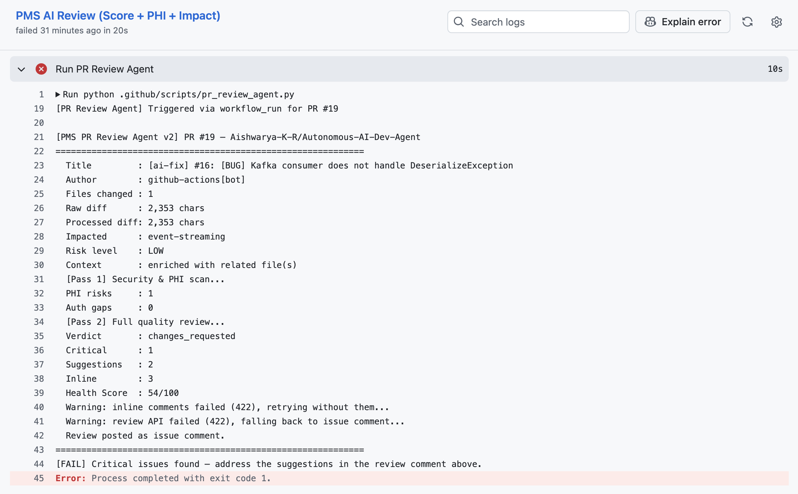
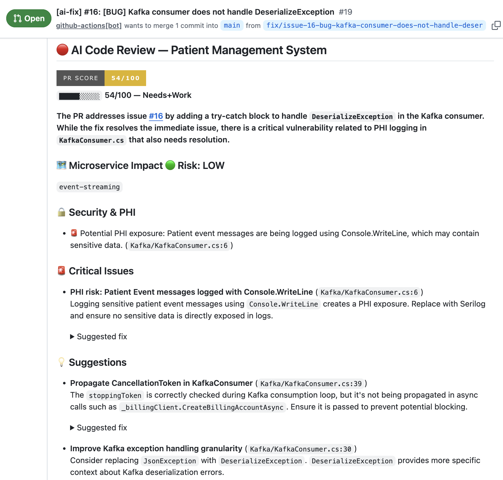

# 🤖 Autonomous AI Dev Agent — Self-Healing Codebase with GPT-4o & GitHub Actions

## 📌 Overview

**Autonomous AI Dev Agent** is a fully autonomous AI-powered developer agent built on GitHub Actions that detects, fixes, and reviews bugs in a healthcare microservices system — with zero manual intervention.

When a bug is reported, the agent:
- 🔍 **Identifies** the affected file automatically from the issue description
- 🛠️ **Generates** a targeted code fix using GPT-4o
- 📬 **Raises** a fix Pull Request autonomously
- 🔎 **Reviews** the fix with a two-pass AI code review (PHI safety + code quality)
- 🚫 **Blocks** unsafe merges via a Health Score gate

> This agent operates on the [PatientFlow Platform](https://github.com/Aishwarya-K-R/PatientFlow-Platform) — a cloud-native .NET 8 healthcare microservices system. Refer to the parent repo for full platform details.

---

## 🏗️ Agent Architecture

```
Developer raises a GitHub Issue (bug)
    └── adds 'bug' label
            │
            ▼
    ┌──────────────────────┐
    │   AI Issue Fix Agent  │   ← GitHub Actions (issue-fix.yml)
    │                       │
    │  1. Fetch repo tree   │
    │  2. GPT-4o: identify  │
    │     affected file     │
    │  3. GPT-4o: generate  │
    │     targeted fix      │
    │  4. Create branch     │
    │  5. Commit fix        │
    │  6. Raise fix PR      │
    └───────────┬───────────┘
                │  workflow_run (automatic)
                ▼
    ┌──────────────────────┐
    │   AI PR Review Agent  │   ← GitHub Actions (pr-review.yml)
    │                       │
    │  Pass 1: PHI/Security │
    │  Pass 2: Code Quality │
    │  Health Score 0–100   │
    │  Post review comment  │
    │  Exit 1 if critical   │
    └───────────┬───────────┘
                │
                ▼
      Branch Protection Gate
  (merge blocked if critical issues)
                │
                ▼
      Developer reviews & merges
```

---

## 🎬 Agent in Action

### Step 1 — Bug Issue Raised
> Developer files a structured bug report and adds the `bug` label. The issue template ensures GPT-4o gets enough context to identify the affected file accurately.



---

### Step 2 — Both Agents Run Automatically (~24s each)
> Fix Agent triggers on the `bug` label. On completion, `workflow_run` fires the Review Agent automatically — no manual trigger, no PAT needed.



---

### Step 3 — Fix PR Auto-Raised by AI Agent
> Agent identifies `Kafka/KafkaConsumer.cs` as the affected file, generates a targeted fix, creates a branch, and raises a PR — all autonomously. `github-actions[bot]` is the author.



---

### Step 4 — PR Review Agent Logs (Two-Pass Scan)
> Review Agent runs two passes: PHI/Security scan followed by full code quality review. Health Score calculated and verdict posted. Exits with code 1 on critical issues — blocking the merge.



---

### Step 5 — AI Review Comment on PR
> Detailed review posted directly on the fix PR — PHI risks, critical issues, suggestions with file + line references, and a Health Score badge. Merge is blocked until issues are resolved.



---

## ⚙️ Components

### 1. 🛠️ AI Issue Fix Agent
**Trigger:** Issue labeled `bug`

| Step | What It Does |
|------|-------------|
| File Detection | Fetches full repo file tree → GPT-4o identifies the single most likely affected file |
| Fix Generation | Sends file content + bug report to GPT-4o → generates a minimal, targeted fix |
| Branch & PR | Creates `fix/issue-{N}-{slug}` branch, commits fix, raises PR referencing the issue |
| Handoff | Uploads PR metadata as artifact → triggers Review Agent automatically via `workflow_run` |

---

### 2. 🔎 AI PR Review Agent
**Trigger:** `workflow_run` after Fix Agent completes — also fires on any human-raised PR

| Pass | What It Checks |
|------|---------------|
| Pass 1 — PHI / Security | Exposed patient data, auth gaps, HIPAA-relevant risks |
| Pass 2 — Code Quality | Logic errors, edge cases, inline fix suggestions |
| Health Score | 0–100 score with verdict: `approved` / `changes_requested` |
| Merge Gate | Exits with code 1 on critical issues → blocks merge via branch protection |

---

### 3. 🛡️ Branch Protection
- Requires a Pull Request before merging to `main`
- Requires `build-and-test` (CI) to pass
- Requires `PMS AI Review (Score + PHI + Impact)` to pass
- Blocks all force pushes

---

## 🔄 End-to-End Flow

```
1.  You file a bug issue on GitHub
2.  Add the 'bug' label
        │
        ▼
3.  AI Fix Agent runs (~24s)
    ├── Auto-detects affected file from issue description
    ├── Generates targeted fix with GPT-4o
    └── Raises fix PR on a new branch
        │
        ▼ (workflow_run — automatic)
4.  AI Review Agent runs (~22s)
    ├── Pass 1: PHI & security scan
    ├── Pass 2: Code quality review
    ├── Posts Health Score + detailed comment on PR
    └── Blocks merge if critical issues found
        │
        ▼
5.  You review the fix PR + AI review comment
6.  Merge if satisfied — or close and fix manually
```

**Your only job: raise the issue.**

---

## 🧠 AI Stack

| Component | Model | Purpose |
|-----------|-------|---------|
| File Detection | GPT-4o (GitHub Models) | Identify affected file from issue + repo tree |
| Fix Generation | GPT-4o (GitHub Models) | Generate targeted, minimal code fix |
| PHI / Security Review | GPT-4o (GitHub Models) | Detect patient data exposure and auth risks |
| Code Quality Review | GPT-4o (GitHub Models) | Logic, correctness, and inline suggestions |

---

## 🏥 Healthcare-Specific Safeguards

- **PHI Detection** — every fix PR is scanned for exposed patient data before merge
- **Two-pass review** — security scan runs independently of code quality review
- **Merge gate** — critical PHI or security issues hard-block the PR from merging
- **Audit trail** — every fix and review is logged as a PR comment and Actions artifact

---

## 🚀 Setup

### Prerequisites
- GitHub repository
- `GH_MODELS_TOKEN` — Personal Access Token with GitHub Models access

### Secrets Required

| Secret | Purpose |
|--------|---------|
| `GH_MODELS_TOKEN` | GitHub Models API access (GPT-4o) |

### How to Trigger

```
1. Create a GitHub Issue describing the bug
2. Add the 'bug' label
3. Watch the Actions tab — both agents run automatically
```

---

## 📁 Project Structure

```
.github/
├── workflows/
│   ├── ci.yml                  # Build & test pipeline
│   ├── issue-fix.yml           # AI Issue Fix Agent trigger
│   └── pr-review.yml           # AI PR Review Agent trigger
├── scripts/
│   ├── issue_fix_agent.py      # Fix Agent — file detection + fix generation + PR creation
│   └── pr_review_agent.py      # Review Agent — PHI scan + quality review + health score
└── ISSUE_TEMPLATE/
    └── bug_report.md           # Structured bug report template
```

---

## 🔗 Related

> The full **PatientFlow Platform** (microservices, Kafka, gRPC, RAG, Kubernetes, Observability) that this agent operates on:
>
> 👉 [PatientFlow Platform — Cloud-Native Microservices with AI & Kafka for Healthcare Ops](https://github.com/Aishwarya-K-R/PatientFlow-Platform)

---

*Built with GitHub Actions + GitHub Models (GPT-4o) — no external infrastructure required.*
